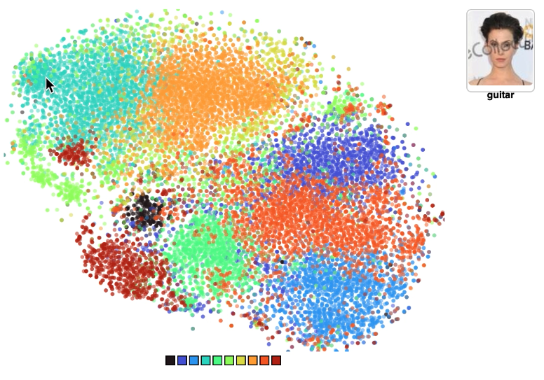
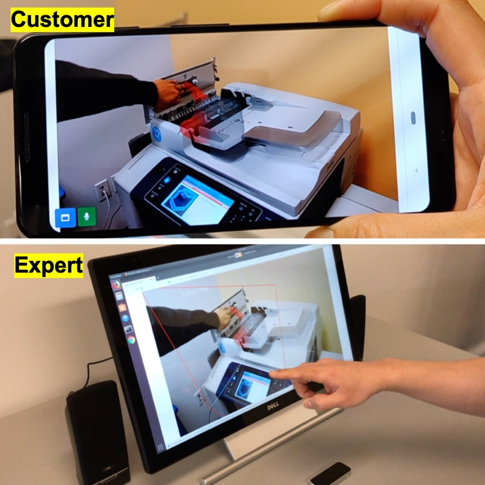
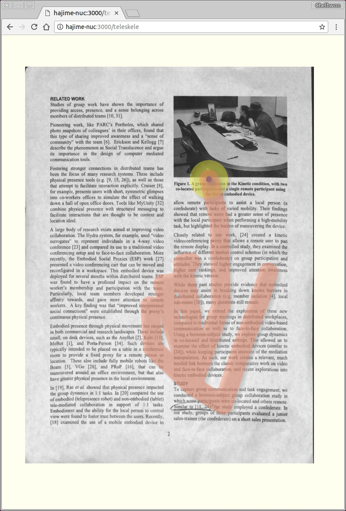
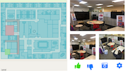
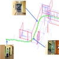
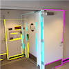
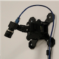
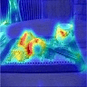
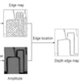





# Chelhwon Kim

I am a computer vision researcher and worked on various computer vision projects, including indoor 3D reconstruction, table-top telepresence system, image-based indoor localization, and cross-domain mapping. I received my Ph.D. in Electrical Engineering at the University of California, Santa Cruz in 2016 under the supervision of Professor Roberto Manduchi in <a href="https://vision.soe.ucsc.edu/">the Computer Vision Lab</a>. 

Resume: <a href="resume/CV.pdf"> CV </a> 

## Project 

<table>
  <tr>        
    <td>
      <b>
        <a href="http://sightsound.org/papers/2021/Chelhwon_Kim_Face-to-Music_Translation.pdf">
        Face-to-Music Translation - CVPR Sight and Sound Workshop, 2021 
        </a> (<a href="https://arxiv.org/abs/2006.13469?utm_source=feedburner&utm_medium=feed&utm_campaign=Feed%3A+arxiv%2FQSXk+%28ExcitingAds%21+cs+updates+on+arXiv.org%29">arXiv preprint version </a>)
        &nbsp;
        <a href="pictures/Face2Music/face_to_musical_note.mp4">[Video]</a>
        <a href="pictures/Face2Music/face-to-music-presentation.mp4">[Presentation]</a>
      </b>  
      <i>Chelhwon Kim, Andrew Port, Mitesh Patel</i>
    </td>    
    <td align="right">  </td>
  </tr>
  <tr>        
    <td>
      <b>
        <a href="https://www.fxpal.com/publications/a-web-based-remote-assistance-system-with-gravity-aware-3d-hand-gesture-visualization/">
        A Web-Based Remote Assistance System with Gravity-Aware 3D Hand Gesture Visualization - ISS'19 Demo
        </a>
        &nbsp;
        <a href="pictures/ISS2019/VideoDemo.mp4">[Video]</a><a href="pictures/ISS2019/Smart-Glass-English_no_audio.mp4">[Video (Smart glasses)]</a>
      </b>  
      <i>Chelhwon Kim, Patrick Chiu, Yulius Tjahjadi</i>
    </td>    
    <td align="right">  </td>
  </tr>
  <tr>        
    <td>
      <b>
        <a href="https://www.fxpal.com/publications/toward-long-distance-tabletop-hand-document-telepresence/">
        Toward Long Distance Hand-Document Telepresence - ISS'19 Poster (Best Poster Award)
        </a>
        &nbsp;
        <a href="pictures/ISS2019/poster_teleskele_ISS-19_v04.pdf">[Poster]</a>
      </b>  
      <i>Chelhwon Kim, Patrick Chiu, Joseph de la Pena, Laurent Denoue, Jun Shingu, Yulius Tjahjadi</i>
    </td>    
    <td align="right">  </td>
  </tr>
    <tr>        
    <td>
      <b><a href="https://www.fxpal.com/publications/info-indoor-localization-using-fusion-of-visual-information-from-static-and-dynamic-cameras/">
        InFo: Indoor localization using Fusion of Visual Information from Static and Dynamic Cameras - IPIN'19
        </a>
      </b>  
      <i>Chelhwon Kim, Chidansh Bhatt, Mitesh Patel, Don Kimber, and Yulius Tjahjadi</i>
    </td>    
    <td align="right">  </td>
  </tr>
  <tr>        
    <td>
      <b><a href="http://www.fxpal.com/publications/capturing-handwritten-ink-strokes-with-a-fast-video-camera.pdf">
        Capturing Handwritten Ink Strokes with a Fast Video Camera - ICDAR'17
        </a>
      </b>  
      <i>Chelhwon Kim, Patrick Chiu, and Hideto Oda</i>
    </td>    
    <td align="right">  </td>
  </tr>
  <tr>        
    <td>
      <b><a href="https://vision.soe.ucsc.edu/node/374">
        Indoor Manhattan Spatial Layout Recovery from Monocular Videos via Line Matching - CVIU (2017)
        </a>
      </b>  
      <i>Chelhwon Kim, and Roberto Manduchi</i>
    </td>    
    <td align="right">  </td>
  </tr>
  <tr>      
    <td>
      <b><a href="https://vision.soe.ucsc.edu/node/363">
        Planar Structures from Line Correspondences in a Manhattan World - ACCV'14
        </a>
      </b>  
      <i>Chelhwon Kim, and Roberto Manduchi</i>
    </td>    
    <td align="right"></td>
  </tr>
  <tr>      
    <td>
      <b><a href="http://www.fxpal.com/publications/high-quality-capture-of-documents-on-a-cluttered-tabletop-with-a-4k-video-camera/">
        High-Quality Capture of Documents on a Cluttered Tabletop with a 4K Video Camera - DocEng'15
        </a>
      </b>  
      <i>Chelhwon Kim, Patrick Chiu, and Henry Tang</i>
    </td>    
    <td align="right"></td>
  </tr>
  <tr>      
    <td>
      <b><a href="JoV2013/SaliencyDetection.html">
        Visual Salinecy in noisy images - JoV (2013)
        </a>
      </b>  
      <i>Chelhwon Kim, and Peyman Milanfar</i>
    </td>    
    <td align="right"></td>
  </tr>
  <!---
  <tr>      
    <td>
      <b><a href="http://citeseerx.ist.psu.edu/viewdoc/download?doi=10.1.1.485.8464&rep=rep1&type=pdf">
        Structured light based depth edge detection for object shape recovery - CVPR'05 Workshop
        </a>
      </b>  
      <i>Chelhwon Kim, Jiyoung Park, Juneho Yi, and Matthew Turk</i>
    </td>    
    <td align="right"></td>
  </tr>
  --->
</table>

## <a href="previous_projects.html"> Previous Projects</a>

## Publications
* Chelhwon Kim, Andrew Port, Mitesh Patel. Face-to-Music Translation. CVPR Sight and Sound Workshop, 2021.

* Chelhwon Kim, Andrew Port, Mitesh Patel. Face-to-Music Translation Using a Distance-Preserving Generative Adversarial Network with an Auxiliary Discriminator. *arXiv preprint*, 2020. arXiv:2006.13469

* Andrew Port, Chelhwon Kim, Mitesh Patel. Earballs: Neural Transmodal Translation. *arXiv preprint*, 2020. arXiv:2005.13291

* Jingwei Song, Mitesh Patel, Andreas Girgensohn, Chelhwon Kim. Combining Deep Learning with Geometric Features for Image based Localization in the Gastrointestinal Tract. *arXiv preprint*, 2020. arXiv:2005.05481

* Chelhwon Kim, Patrick Chiu, Yulius Tjahjadi. A Web-Based Remote Assistance System with Gravity-Aware 3D Hand Gesture Visualization. *ACM International Conference on Interactive Surfaces and Spaces (ISS)*, 2019. Demo paper.

* Chelhwon Kim, Patrick Chiu, Joseph de la Pena, Laurent Denoue, Jun Shingu, Yulius Tjahjadi. Toward Long Distance Hand-Document Telepresence. *ACM International Conference on Interactive Surfaces and Spaces (ISS)*, 2019. Poster paper.

* Chelhwon Kim, Chidansh Bhatt, Mitesh Patel, Don Kimber, Yulius Tjahjadi. InFo: Indoor localization using Fusion of Visual Information from Static and Dynamic Cameras. *International Conference on Indoor Positioning and Indoor Navigation (IPIN)*, 2019.

* Laurent Denoue, Scott Carter, Chelhwon Kim. CamaLeon: Smart Camera for Conferencing in the Wild. *ACM International Conference on Multimedia (MM)*, 2019. Demo paper.

* P. Chiu, C. Kim, and H. Oda. Recognizing Gestures on Projected Button Widgets with an RGB-D Camera Using a CNN. *ACM International Conference on Interactive Surfaces and Spaces (ISS)*, 2018.

* C. Kim, P. Chiu, and H. Oda. Capturing Handwritten Ink Strokes with a Fast Video Camera. *International Conference on Document Analysis and Recognition (ICDAR)*, 2017.

* S. Ma, Q. Liu, C. Kim, and P. Sheu. Lift: Using Projected Coded Light for Finger Tracking and Device Augmentation. *Pervasive Computing and Communications (PerCom)*, 2017.

* C. Kim and R. Manduchi. Indoor Manhattan Spatial Layout Recovery from Monocular Videos via Line Matching. *Computer Vision and Image Understanding (CVIU)*, 2016.

* T. Dunnigan, J. Doherty, D. Avrahami, J. Biehl, P. Chiu, C. Kim, Q. Liu, H. Tang, and L. Wilcox. Evolution of a Tabletop Telepresence System through Art and Technology. *ACM Multimedia Conference*, 2015.

* C. Kim, P. Chiu, and H. Tang. High-Quality Capture of Documents on a Cluttered Tabletop with a 4K Video Camera. *Proceedings of ACM DocEng*, 2015.

* C. Kim and R. Manduchi. Planar Structures from Line Correspondences in a Manhattan World. *In 12th Asian Conference on Computer Vision (ACCV)*, 2014.

* C. Kim, P. Chiu, and S. Chandra. Dewarping Book Page Spreads Captured with a Mobile Phone Camera. *CBDAR*, 2013.

* C. Kim and P. Milanfar. Visual Saliency in Noisy Images. *Journal of Vision 13(4):5*, March 11, 2013.

* C. Kim and P. Milanfar. Finding Saliency in Noisy Images. *SPIE Conference on Computational Imaging (8269)*, January 2012.

* J. Y. Park, C. Kim, J. K. Na, J. H. Yi, and M. Turk. Using structured light for efficient depth edge detection. *Image and Vision Computing, Vol. 26, Issue 11, pp 1449~1550*, 2008.

* J. Y. Park, C. Kim, J. H. Yi, and M. Turk. Efficient depth edge detection using structured light. *Lecture Notes in Computer Science, Vol. 2869, pp. 413-420*, 2005.

* C. Kim, J. Y. Park, J. H. Yi, and M. Turk. Structured light based depth edge detection for object shape recovery. *IEEE CVPR Workshop on Projector-Camera Systems*, 2005.

* J. H. Yi, D. Y. Lee, C. Kim. A 2D plane of RGB color space for color histogram based skin color segmentation. *6th Asian Conference on Computer Vision, pp 926~930*, 2003. 
